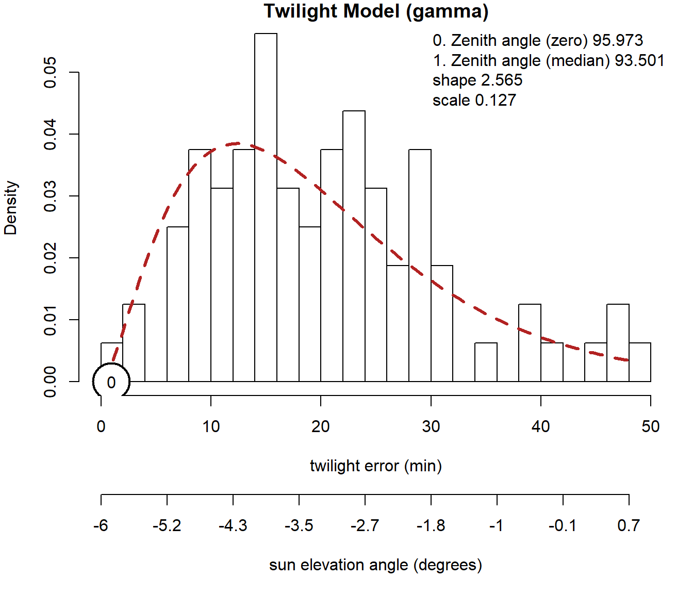

<!-- README.md is generated from README.Rmd. -->
<!-- badges: start -->
<!-- badges: end -->

## invMovements: R functions to identify movements in light-level geolocation data

The identification of movements in light level geolocation data is of
prime interest, since it can significantly improve track estimates using
the `groupedThresholdModel` in the R package
[SGAT](https://github.com/SWotherspoon/SGAT). Different to most other
track estimation method, where the location of each identified twilight
event or twilight period will estimated, the `groupedThresholdModel`
uses prior knowledge on whether a twilight event or a sequence of
twilight events were likely recorded at one location, without
intermittent movements, and subsequently estimates single best locations
for these stationary periods with associated credibility intervals. In
doing so, the location estimates of stationary periods (e.g. stopovers,
major non-breeding sites) seem to get a more accurate estimate and
outliers (caused by e.g. strong shading during twilight) in twilight
times are less influential. For more information see Lisovski, Bauer, et
al. (2020) and Chapter 7 *The Group Model* in the [geolocation
manual](https://geolocationmanual.vogelwarte.ch/).

However, the identification of movements in a series of twilight events
is rather complicated. Most twilight events in geolocationd datasets
(identified via the threshold method: see Lisovski, Bauer, et al.
(2020)) are somewhat inaccurate since the logger recording light
intensities on the animal is rarely exposed to the unobscured sun;
clouds, rain, vegetation, mountains, feathers, are all factors that can
alter the true light intensity. Thus, movements and the associated
changes in twilight times can only be detected of the difference in
sunrise or sunset times is larger than the error in the twilight events.
And secondly, the magnitude of the changes in twilight times caused by
movements depends (besides distance) on the bearing and the time of the
year; some movements may only cause changes in either sunrise and sunset
times.

The R package `GeoLight` (Lisovski and Hahn 2012) includes a function
that uses *changepoint* analyses to identify changes in twilight events
(see chapter 3 *Movement analyses* of the [geolocation
manual](https://geolocationmanual.vogelwarte.ch/)). While the
`changeLight` function seem to work in many instances and provided
acceptable results for lots of datasets, the analytically process in the
function is not exactly correct and probably too simplistic (not
accounting for the error structure of the data). Most significantly, the
changepoint analysis assumes a normal distribution of the error in the
data, in this case the twilight events. However, the error in twilight
times is known to follow a *log-normal* or a *gamma* distribution (see
Figure 1).

<figure>
 
<center>

<figcaption>
Figure 1: Typical twilight error structure in light-level geolocation
data.
</figcaption>
</center>
</figure>

 

Here, I aim to present the R package `{invMovement}` allowing
investigation of potential movements based on the error structure of the
underlying twilight error distribution.

The following functions are part of the R package `{invMovement}`:

-   invChanges
-   extractMovements
-   gammaSens
-   groupSensitivity
-   groupSummary
-   mergeGroups

**NOTE!** The functions of the `{invMovement}` package have already been
used and results have been published (e.g. Sander et al. (2021),
Lisovski, Gosbell, et al. (2020)), I consider them in development. The
theoretical concept behind the functions seems correct, however,
especially the multi-core performance is not optimal and could be
improved by e.g. using the future framework in R.

## Installation

Install the released version of `{invMovement}` from GitHub:

``` r
# install.packages("remotes")
remotes::install_github("slisovski/invMovement")
```

## References

<div id="refs" class="references csl-bib-body hanging-indent">

<div id="ref-Lisovski_2020" class="csl-entry">

Lisovski, Simeon, Silke Bauer, Martins Briedis, Sarah C. Davidson, Kiran
L. Dhanjal-Adams, Michael T. Hallworth, Julia Karagicheva, et al. 2020.
“Light-Level Geolocator Analyses: A User’s Guide.” *Journal of Animal
Ecology* 89 (1): 221–36.
https://doi.org/<https://doi.org/10.1111/1365-2656.13036>.

</div>

<div id="ref-Lisovski2020JAE" class="csl-entry">

Lisovski, Simeon, Ken Gosbell, Clive Minton, and Marcel Klaassen. 2020.
“Migration Strategy as an Indicator of Resilience to Change in Two
Shorebird Species with Contrasting Population Trajectories.” *Journal of
Animal Ecology* n/a (n/a).
https://doi.org/<https://doi.org/10.1111/1365-2656.13393>.

</div>

<div id="ref-Lisovski_GeoLight" class="csl-entry">

Lisovski, Simeon, and Steffen Hahn. 2012. “GeoLight – Processing and
Analysing Light-Based Geolocator Data in r.” *Methods in Ecology and
Evolution* 3 (6): 1055–59.
https://doi.org/<https://doi.org/10.1111/j.2041-210X.2012.00248.x>.

</div>

<div id="ref-Sander2021" class="csl-entry">

Sander, Martha Maria, Dan Chamberlain, Camille Mermillonm, Ricardo Alba,
Susanne Jaehnig, Domenico Rosselli, Christoph Manuel Meier, and Simeon
Lisovski. 2021. “Early Breeding Conditions Followed by Reduced Breeding
Success Despite Timely Arrival in an Alpine Migratory Songbird.”
*Frontiers in Ecology and Evolution*.

</div>

</div>
